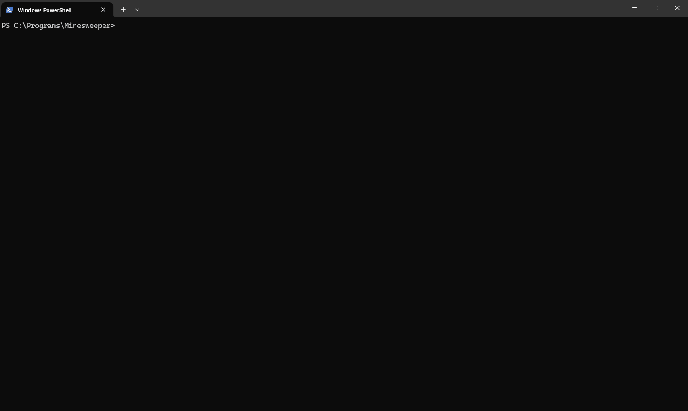

# 💣 Minesweeper in Python 💣

## Demo



## Project Description

This project is an implementation of the classic Minesweeper game, developed in Python. The main goal of this project was to learn and demonstrate a clear separation between the core functionality of the game and its visual representation.

### What I've Learned 📖

Through this project, I've learned to:

- **Develop modular applications**: Separating the game logic from its visual representation.
- **Use Poetry**: As a package manager and development environment.
- **Create terminal interfaces**: Implementing both a basic interface and a terminal user interface (TUI).
- **Design extensible software**: Allowing the easy addition of new interfaces, such as a graphical interface with Tkinter or a web interface.
- **Implement advanced algorithms**: Utilizing the breadth-first search (BFS) algorithm to discover adjacent cells on the game board.
- **Use Iterables efficiently**: Passing iterators instead of data structures like lists to avoid side effects and improve performance.

### What I've Done ⛏️

- Implemented the Minesweeper game logic in a modular manner.
- Developed two types of terminal user interfaces.
- Designed the project to be easily extensible, enabling the integration of new visual interfaces.
- Utilized BFS for cell discovery, optimizing the revealing of safe areas on the board.
- Opted for the use of iterators instead of lists in various parts of the code to enhance efficiency and avoid side effects.

## Features ⚙️

- **Language**: Python
- **Package Manager**: Poetry
- **Interfaces**: Terminal and Terminal User Interface (TUI)
- **Modularity**: Clear separation between game logic and visual representation.
- **Discovery Algorithm**: BFS for discovering adjacent cells.
- **Data Handling Efficiency**: Use of iterators to avoid side effects.

## Installation 💻

To start using the project, follow these steps:

1. **Clone the repository**:

   ```bash
   git clone https://github.com/cebrianj/Minesweeper.git
   cd Minesweeper
   ```

2. **Install Poetry**:
   If you haven't installed Poetry yet, you can do so by following the [official instructions](https://python-poetry.org/docs/#installation).

3. **Install project dependencies:**:
   ```bash
   poetry install
   ```

## Usage

To run the game you just need to execute `poetry run main`
